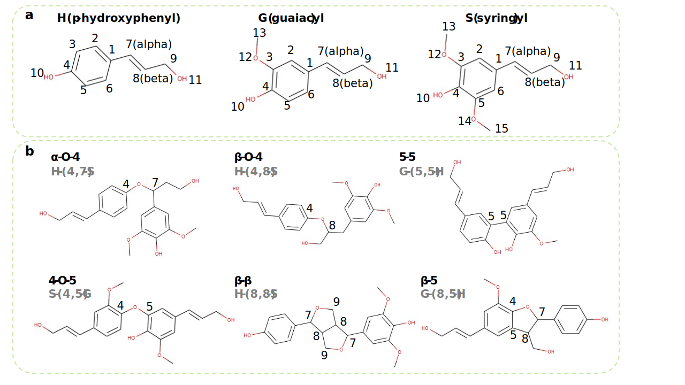

===================
Bluiding Blocks
===================

Monomers
-----------------

Figure a shows the three monomer units in lignin, p-hydroxyphenyl (H), syringyl (S), guaiacyl (G). 
We assign an atomic index to each C and O atom in a monomer following the standard convention. 
α stands for the 7th C and β stands for the 8th C. 
Such index information is useful to correctly bond atoms as linkages in graph representations.

Linkages
-----------------

Figure b shows example dimmers consisting of the six common linkages, 
namely α-O-4, β-O-4, 5-5, 4-O-5, β-β, and β-5. 

A linkage between two units is written as the M1-(C1,C2)-M2 (M1 = the type of the first monomer, M2 = the type of the second monomer, C1 = atomic index of the bonding C in the first monomer, C2 = atomic index of the bonding C in the second monomer). 
For instance, H-(4,7)-S represents an α-O-4 linkage between an H and an S monomer.