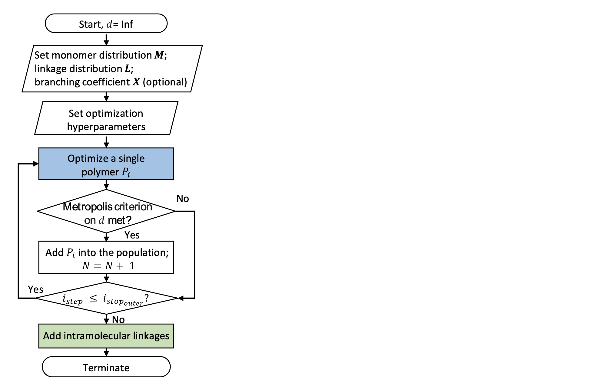
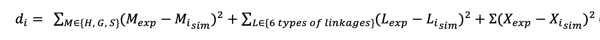
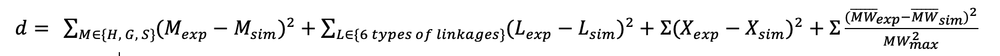

===================
Optimization
===================

We utilize a Metropolis Monte Carlo algorithm to obtain a library of structures and global metrics to compare to target experimental data. 
The hierarchical scheme (Figure above) optimizes the molecular and population structures and refines them with intramolecular linkages. 

1. Inner optimization loop : We first optimize a single polymer molecule by repeatedly adding monomers (linkages). 

2. Outer optimization loop : Next, we optimize the entire population. 

3. Intramolecular linkage optimization loop: Each event is accepted depending on the Metropolis criterion

We define a single distance metric :math:`d_{i}` for a polymer molecule :math:`P_{i}` as the sum of squared errors:

Here, M, L, X are the monomer percentages, linkage percentages, and additional metrics, 
such as the branching coefficient, respectively; exp denotes the experimental values and sim simulated values. 
For a population, the distance d applies to the global Ms, Ls, and Xs:  

