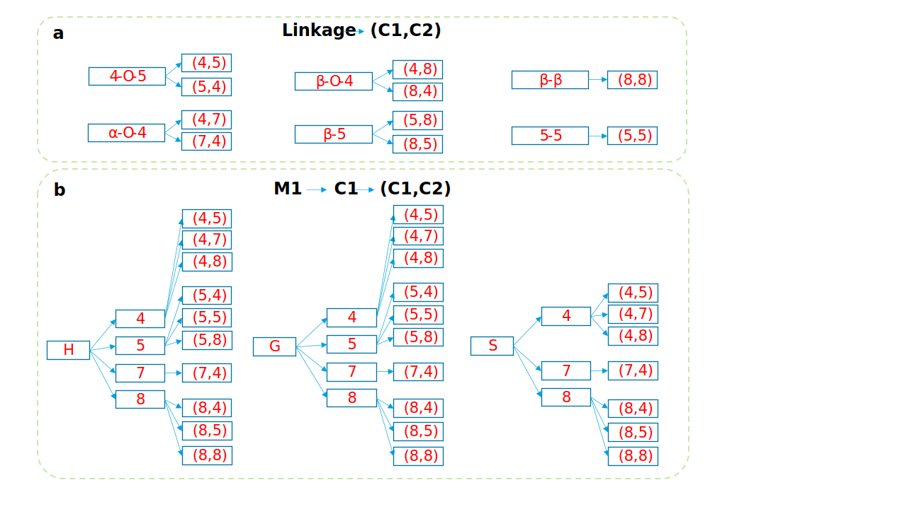

===================
Polymerization
===================

We model the growth of a single lignin polymer chain via a reconstruction process. 

.. code-block::

     P'-M1(C1) + (C2)M2 -> P'-M1-(C1,C2)-M2

Starting from a monomer, we add monomers one at a time with different linkages. 
Connecting a monomer M1 of a growing polymer to a monomer M2 with the correct linkages requires identifying the bonding atoms' possible atomic index pairs, i.e., the (C1,C2) pairs. 
C1 refers to the bonding C atom index in M1 (in a polymer) and C2 to M2 (a new monomer for each addition). 

Therefore, we list the mapping rules for each monomer or linkage-type to atomic index pairs in the figure, 
and store them in Python dictionaries (hash maps) to achieve fast lookup operations at a constant time, of order 1, O(1). 

To add a specific linkage or monomer, we obtain the possible atomic index pairs and C1s via the mapping rules. 
We also keep a list of available bonding atoms and their atomic indices (i.e., the C1s) in the growing polymer. 
We quickly narrow down the suitable C1 atoms by taking the intersections of the two C1 lists. Next, one of the C1s is selected randomly and connected with the corresponding C2. 
From a C2 index, one could use the reverse mapping in (b) and determine the correct monomer type for the addition (C2→M2). 
A new edge in the graph is connected, and its “bonding” properties are marked as False. 

Each addition is essentially a rejection-free Monte Carlo event, i.e., a monomer and a linkage are always added. We achieve a linear time (O(n), where n is the polymer size, for each addition and eliminate unsuccessful attempts. 
Users may add a specific monomer, linkage (e.g., a ring formation with no monomer), or ring, and a random monomer or ring. The rules ensure that the structures are always chemically valid. 

A `polymer` object can be inherited from a `Monomer` object.

.. code-block::

     import ligning.monomer as mono
     import ligning.polymer as poly
     # create a monomer object first
     P0 = mono.Monomer("G")
     P0_G = P0.create()
     # initialize a polymer object with a monomer
     polymer = poly.Polymer(P0)

The user can add a specific linkage or monomer using the following functions:
1. Add a specific linkage type and a specific monomer

.. code-block::

     # Add a G unit and a specific linkage type
     polymer.add_specific_linkage(linkage_type = 'beta-O-4', monomer_type = 'G')

2. Given a specific linkage type, add a possible monomer at random

.. code-block::

     # Add a specific linkage type
     polymer.add_specific_linkage(linkage_type = 'beta-5') 

3. Given a specific monomer type, add a possible linkage at random

.. code-block::

     # Only specify the monomer type
     polymer.add_specific_monomer(monomer_type = 'S') 

4. Add a possible linkage and monomer at random 

.. code-block::

     # No need to specify
     polymer.add_random_monomer()

5. Add a ring with a specific linkage type 

.. code-block::

     # No need to specify
     polymer.add_specific_ring(linkage_type = 'beta-5')

6. Add a possible ring at random 

.. code-block::

     # No need to specify
     polymer.add_random_ring()

